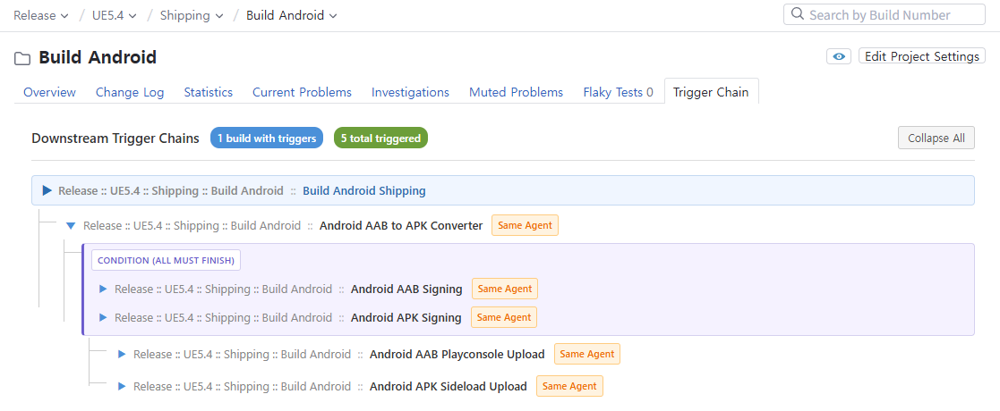

# Trigger Chain View

A TeamCity plugin that visualizes **Finish Build Trigger** chains for each build configuration.

When builds are connected via Finish Build Triggers (e.g., Build A triggers Build B, Build B triggers Build C), this plugin shows the **entire downstream chain** as a tree view — making it easy to understand the full trigger flow at a glance.

## Screenshot



## Features

- **Downstream Trigger Chain** — See all builds that are triggered (directly or indirectly) when a build finishes
- **Recursive Tree View** — Chains are displayed as an expandable tree, showing the full depth of trigger relationships
- **Full Project Path** — Each build displays its complete project hierarchy (e.g., `Release :: Client :: KR :: Android :: Build A`)
- **Project-Level View** — See all trigger chains across all build configurations within a project and its sub-projects at once
- **Live Build Progress** — Real-time status tracking for each build in the chain:
  - **Running** — Progress bar with percentage
  - **Queued** — Waiting in the build queue
  - **Success / Failure** — Completed build result
  - **Pending** — Waiting to be triggered (chain in progress)
- **Auto-Refresh** — Seamless AJAX-based refresh (no page reload) while a chain is in progress
- **Circular Reference Detection** — Circular trigger chains are detected and marked to prevent infinite loops
- **Expand / Collapse All** — Quickly expand or collapse the entire tree
- **Supports Multiple Trigger Types**
  - Built-in TeamCity **Finish Build Trigger**
  - [Finish Build Trigger (Plus)](https://github.com/xwoojin/teamcity-finish-build-trigger-plus) plugin

## How It Works

Consider this trigger setup:

```
Build A (finishes)
  ├── triggers → Build AAA
  │                └── triggers → Build BBB
  └── triggers → Build B
                   └── triggers → Build C
                                    └── triggers → Build D
```

When you open **Build A** and click the **"Trigger Chain"** tab, you'll see the full downstream chain with live status:

```
Release :: Client :: KR :: Android :: Build A       CURRENT   #27 ▶ 15%
  ├── Release :: Client :: KR :: IOS :: Build AAA             Pending
  │     └── Release :: Client :: KR :: WINDOW :: Build BBB    Pending
  └── Dev :: NewOne :: Build B                                Pending
        └── AnotherDev :: OldOldNew :: Build C                Pending
              └── PM :: Piel :: Build D                       Pending
```

The status updates automatically as the chain progresses — no manual refresh needed.

You can also view trigger chains at the **project level**: open any project and click the **"Trigger Chain"** tab to see all chains within that project and its sub-projects.

## Installation

1. Download the latest `trigger-chain-view.zip` from the [Releases](https://github.com/xwoojin/teamcity-trigger-chain-viewer/releases) page
2. Go to **TeamCity Administration → Plugins**
3. Click **Upload plugin zip** and select `trigger-chain-view.zip`
4. Enable the plugin and restart TeamCity server if prompted

## Building from Source

### Prerequisites

- Java 11+
- Maven 3.x
- TeamCity server installation (for local lib dependencies)

### Build

Update `teamcity.home` in `pom.xml` to point to your TeamCity server installation, then:

```bash
./build.sh
```

This will automatically increment the version (`YYMMDD.N`) and build the plugin ZIP.

The plugin ZIP will be created at: `dist/trigger-chain-view.zip`

## Compatibility

- **TeamCity**: 2025.11+ (build 208117+)

## Version Format

`YYMMDD.N` — where `YY` = year, `MM` = month, `DD` = day, `N` = build number of the day.

## License

MIT License

## Author

**WooJin Kim** — [GitHub](https://github.com/xwoojin)
